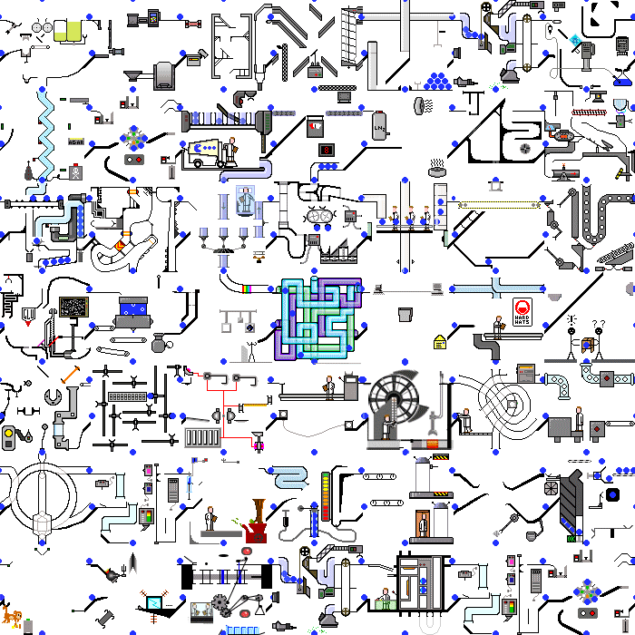

# Blue Ball Machines: Translating between the software and hardware universes.

If you haven't already seen the "Blue Ball Machine" gif, stare at it now until you get tired of it then continue on with the essay:

(It's animated, you may need to click on it or open it in a new tab to see the details if you're viewing this in the dark Github theme)



----------

I've been programming professionally for about 25 years now; my jobs have been a mix of system optimization, graphics engine programming, and most recently (as of ~5 years ago) software and firmware to support hardware research projects. In my free time I mess with game console emulators, low-level hardware stuff, and blinky lights.

In both my day job and in my personal projects, I tend to run into tasks like these:

1. Given a Verilog module, write an emulator for it in {higher-level language}.
2. Given an emulator in {higher-level language}, write a Verilog module for it.

So, it's not an exaggeration to say that I have a vested interest in understanding how procedural and RTL models behave and how their behaviors can diverge. One of my personal projects is GateBoy, a gate-level simulation of a Game Boy written in C++ that was reverse-engineered from die shots and annotations started by another dev (Furrtek, big thanks for his work). Getting from the initial guesstimated schematics to a working system took over a year of painful debugging, which I often described as like solving a 2000-cell Sudoku when you don't know all of the rules.

After tracking down one too many bugs in GateBoy due to almost-but-not-quite-right behavioral errors, I started to wonder if there was a way of automating the process. Could I write a tool that would be able to tell at compile time if my C++ emulators were doing something that would misbehave in hardware? Could that tool just write some Verilog for me? I'd done enough manual translation at that point that I had a basic idea of what the "rules" needed to be, but I hadn't formalized anything. I did produce a proof-of-concept translator tool based on LLVM that was a big unmaintainable hack, but it suggested that the idea wasn't ridiculous - it was just a bigger project than I wanted to yak-shave at the time.

Instead of the translator, I started working on a variety of "helper" techniques to try and catch errors in advance. C++ classes that throw errors if you write to them twice, making all local variables const so they can't change in the middle of a function, appending "_old" and "_new" and "_even" and "_odd" tags to _everything_ to keep track of which variables changed and on what cycles. That clarified the rules quite a bit - always distinguish old state from new state, make sure that all flip-flop's data inputs are calculated from the old state and the clock/reset lines from the new state, that sort of thing. The rules only made sense in the context of the codebase I'd written, but they uncovered a lot of bugs and took GateBoy from a barely functioning mess to a mostly-functioning-but-still-with-a-few-glitches mess.

After I published GateBoy, I started working on "lifting" it into more normal-looking C to create "LogicBoy" - uint8_t's instead of arrays of flip-flops, if() statements instead of muxes, but always maintaining an exact lock-step match between the two through the whole test suite. Once I got Logicboy running at 60 fps, I started to really really want that magic translation tool. I figured that someone else had probably written one by now, so I poked around Wikipedia and Google Scholar and various FPGA forums to see what was out there. While there was a a ton of research into high-level synthesis, none of it answered a fundamental question that had been irking me - given program A in {language} and program B in Verilog, how can we determine at compile time if the two compute the same thing? This really felt like a question that would've been answered back in the 1960s, formalized into some algorithm alongside A* and s-expressions.

After both frustration and surprise at finding nothing relevant, I decided I'd actually write the tool. It took me about six months. Early on I stumbled across TreeSitter while looking for an easier way to parse C++, and both the API and the codebase looked like something that would fit into a standalone tool. I managed to get a basic version of the translator working fairly quickly, though it relied on magic naming prefixes and calling conventions and public member variables everywhere and didn't feel like a general-purpose tool. It worked for my special codebase with my special conventions and while it was functional, it wasn't anything like the 1960's algorithms that I had imagined must exist.

I started reworking the correctness checker next, which was initially a sort of key-value store populated during translation time and then checked for errors at the end. I split it out into its own module and probably wrote and threw away three full implementations of the checker before settling on the one I have now. As I started to close in on a version that seemed to catch all the corner cases I could think of, I realized that I could ditch the naming prefixes in some cases - if prefix A means that the variable has to end up in state B, then (logic permitting) I can ditch the prefix and just infer it by the fact that we ended up in state B. Extending the checker logic with the "rules" I'd learned from the GateBoy project, I was eventually able to get something that could take a subset of unannotated C++ and tell me which member variables were "register"-like and which were "wire"-like.

At this point I kinda felt like I was onto something, but I was worried. I didn't really have _rules_ in a formal sense, I had heuristics. Heuristics that worked in the cases that I could think of, but I didn't trust myself to actually be able to think of all possible cases. I set the checker code aside for a week and started walking through various chunks of matched-up C++ and Verilog line by line, annotating variable states as I did so. I picked a trivial representation of the variable states - N means "Not touched yet", R means "Variable has been read", W means "Variable has been written", and just concatenated the Rs and Ws as they're hit in the code. I handled branching code by writing down the symbols after both branches with a line between them- R in the "if" and W in the "else" produces R|W. One thing I noticed in doing this is that all the C++ code that I knew matched the Verilog code's behavior only produced a small set of symbols - symbols that followed the same rules I'd sketched out in GateBoy, just now in more... symbolic form.

Together, the set of all possible symbols formed a weird sort of state machine. Serial code appended R/W to a symbol to turn it into a new symbol, branching code duplicated symbols and then merged them back together with "|". Since I didn't need to track multiple reads or writes in a row or multiple branches that all do the same thing, the set of all possible symbols shrunk down to 32 - a manageable if slightly large size for a state machine. I was able to shrink the set of states down further by removing states that wouldn't be allowed in valid Verilog and merging equivalent states together into larger groups. That resulted in the seven states that Metron uses now - "NONE, INPUT, OUTPUT, SIGNAL, REGISTER, MAYBE, INVALID". Trace all member variables through a codebase, apply the state machine update rules every time you see a read or write or branch, and you can determine (I won't say prove yet since my logic is fairly informal) if a function in {language} behaves the same as a function in Verilog.

At that point I felt like I was really obligated to publish something. I figured that as long as I was writing all this stuff up, I should put together a live demo where you can type code in one side and see the translated version come out the other side. I'd always enjoyed tools like Compiler Explorer and JSFiddle and that seemed to be a good way to get people interested. A tutorial seemed appropriate too - this was a pretty weird project and I still wasn't 100% convinced that it would make sense to anyone except me, so writing it all down in tutorial form would be a good way to get all my thoughts straight.

And so that became Metron v0.0.1, published at https://github.com/aappleby/Metron - complete with live demo, live tutorial, and a slightly more fleshed-out explanation of the code-traversing, symbol-concatenating algorithm I mentioned above.

----------

# ...so what does all of that have to do with the blue ball machines?

Go back the ball machine gif and watch it a bit more. Try and follow a single blue ball through the system as far as you can. Now pick a single widget in the machine and try to keep track of where the balls enter and exit it, and in what order. No single viewpoint on its own completely describes the machine - there's just too much _stuff_ happening all at once, and trying to describe the system solely in terms of balls moving or machines machining doesn't capture it fully.

This sort of disconnect shows up when you have mixed hardware/software teams trying to build new systems together. When the hardware engineers ask the software engineers questions, the discussion tends to go something like this:

```
HWE: "Hey, can you send me the source code to the ball incinerator? I need to
      get some dimensions nailed down."

SWE: "Sure thing!" *sends link to code repo*

HWE: "...This is a novella about ball-machine-building. I just need to know
      where the flamethrower goes."

SWE: "Oh, right - if you turn to page 27 there's a list of all the flame sources
      we can install, and then on page 332 you can see how the installation
      location is selected based on the user's stored preferences."
```

And then later when the software engineers ask the hardware engineers questions, it goes like this:

```
SWE: "If you've got a minute, can you help me out with something? I'm working on
      the Zamboni driver and I need to know the format of the input balls."

HWE: "Oh, no problem - it's right here:" *blue_ball_machine.gif*

SWE: "Is that... what am I even looking at?"

HWE: "It's the Zamboni, right there in the top left. Just under the packet
      shuffler."
```

That's an exaggeration, but you get the point. Software engineers perceive hardware designs as something in between abstract art and Rube Goldberg machines - slabs of code strewn with disconnected variable names and interspersed with cryptic blocks of logic that somehow collectively manage to do something useful. Hardware engineers perceive software designs like bookshelves full of instruction manuals, always describing the "how" but never the "what". The software is amorphous, transient, a code ghost that whispers life into the machine when it's not causing the testbench to lock up for no apparent reason.

I think both viewpoints are valid, and that both disciplines could learn a lot from each other. Software needs a stronger concept of the "what", the model of the program as an assemblage of concrete objects that can be seen and discussed independently of the source code. Hardware needs a stronger concept of the "how", the processes and sequences that tie all the machines together into something that accomplishes work.

* Hardware engineers are watching the machines move the balls.
* Software engineers are watching the balls move through the machines.


-Austin Appleby
